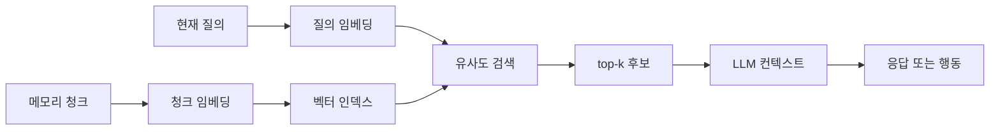
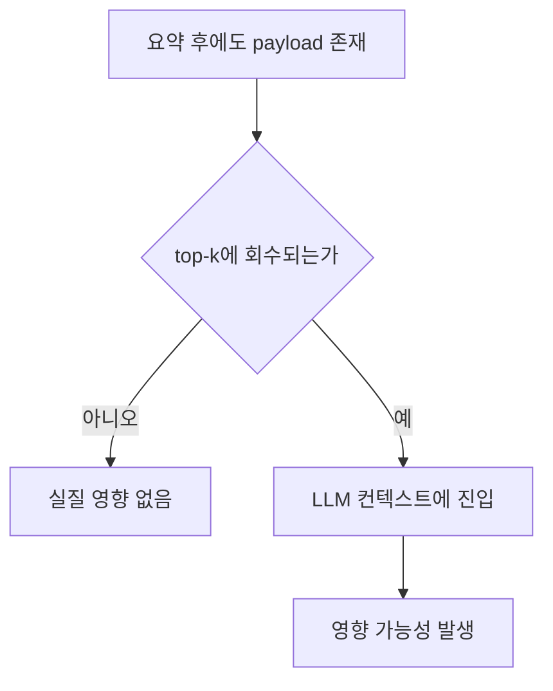

공부 진행용DeepResearch_Part 3_(Chat_GPT)

# 임베딩 기반 검색은 어떻게 기억을 다시 활성화하는가

## 핵심 요약

초기 요청은 주제를 특정하지 않았지만, 업로드된 연구 브리프는 이번 보고서가 “기억 통합 이후에도 남아 있는 instruction-like malicious payload가 나중에 실제로 검색되어 활성화될 수 있는가”라는 보안 연구 맥락의 **retrieval 측면**을 다루도록 구체화한다. 따라서 본 보고서는 그 브리프를 기준으로, 실험 설계 이전 단계에서 반드시 이해해야 할 retrieval의 원리와 해석법을 교육적으로 정리한다. fileciteturn0file0 fileciteturn1file0

이 보고서의 핵심 결론은 단순하다. **메모리에 어떤 내용이 남아 있다는 사실**과 **그 내용이 나중에 실제 행동에 영향을 미친다는 사실**은 다르다. 그 사이를 연결하는 단계가 retrieval이다. RAG 계열 시스템은 현재 질의를 벡터로 바꾸고, 저장된 문서·메모리 청크를 관련도 순위로 정렬한 뒤, 상위 후보(top-k)만 모델 컨텍스트에 올린다. 따라서 payload가 요약이나 메모리 통합을 통과해 살아남았더라도, retrieval 단계에서 회수되지 않으면 실질적 효과는 발생하지 않는다. 최근 RAG 보안 연구들도 공격 성공의 필요조건으로 “악성 문서가 실제로 retrieve되어 컨텍스트에 들어오는가”를 반복해서 강조한다. citeturn10search0turn5search3turn5search7turn5search11

이 관점에서 dense retrieval은 의미 유사성을 이용해 paraphrase를 잡아낼 수 있지만, BM25보다 “항상 더 낫다”는 뜻은 아니다. Dense retriever는 semantic ambiguity, negation, under-specified query, paraphrase 변형에 흔들릴 수 있고, BEIR 같은 이질적 벤치마크는 단일 접근법이 모든 데이터셋에서 일관되게 우세하지 않음을 보여준다. 그래서 학생의 연구에서는 **survival(남아 있음)** 과 **retrieval(회수됨)** 을 분리해서 측정해야 하며, dense baseline과 BM25 baseline을 함께 두고, Hit@1과 Hit@3로 “payload가 실제로 회수되는가”를 먼저 보는 것이 해석 가능성이 높다. citeturn0search1turn3search11turn3search7turn7search0turn7search2turn3search9turn8search9

## 연구 프레임과 방법

이번 보고서의 연구 질문은 네 가지다. 첫째, 정보검색(IR)은 무엇이며 왜 데이터베이스 질의와 다르게 **정확한 일치**가 아니라 **관련도 순위**를 다루는가. 둘째, BM25 같은 lexical retrieval과 임베딩 기반 dense retrieval은 무엇이 다르며, 요약·압축된 메모리의 회수 가능성에 어떤 차이를 만드는가. 셋째, retrieval이 왜 memory poisoning/attack activation의 관문인가. 넷째, Hit@k, Recall@k, Precision@k 같은 지표로 “payload가 실제로 retrievable한가”를 어떻게 해석할 수 있는가. 이 질문 구성은 업로드된 브리프의 요구사항을 직접 따른다. fileciteturn1file0

범위는 의도적으로 좁다. 이 보고서는 **full attack experiment를 설계하지 않는다**. 대신 학생이 나중에 실험을 설계할 때 해석 오류를 피할 수 있도록 retrieval 시스템의 개념, 동작 원리, failure mode, 평가 지표, 실무적 baseline 선택 기준을 정리한다. 다시 말해, 초점은 “어떻게 공격을 더 잘 만들 것인가”가 아니라 “검색이 실제로 무엇을 하고, 그것이 왜 실험 해석의 핵심 변수인가”에 있다. 이 역시 브리프의 범위 규정을 따른다. fileciteturn0file0 fileciteturn1file0

방법론은 다음과 같다. 기초 개념은 entity["book","Introduction to Information Retrieval","2008 ir textbook"]와 관련 Stanford HTML 장을 기준으로 잡고, dense retrieval과 RAG의 구조는 DPR와 RAG 원논문, 실무적 구현은 sentence-transformers·Faiss·BM25 공식 문서, 일반화 성능과 baseline 논의는 BEIR, RAG 시대의 평가 문제는 eRAG·RAGAs·RAGChecker·UDCG, 보안 함의는 PoisonedRAG·Machine Against the RAG·최근 retrieval poisoning 논문을 중심으로 검토했다. 포함 기준은 **영어권 원논문/공식 문서 우선**, **2023–2026 최신 연구 우선**, 그리고 필요한 경우에만 2020년 전후의 seminal paper를 보조적으로 포함하는 방식이었다. citeturn11search2turn2search7turn0search1turn10search0turn0search2turn4search22turn1search8turn3search3turn9search0turn1search3turn12search8turn9search1turn5search12turn5search11turn5search3

아래 표는 이 보고서가 기대고 있는 근거군을 요약한 것이다.

| 증거군 | 대표 근거 | 시기 | 이 보고서에서 쓰는 핵심 주장 | 신뢰도 판단 |
|---|---|---:|---|---|
| 기초 IR | Stanford IR 교재와 HTML 장들 citeturn11search2turn2search7turn2search0 | 2008–2009 | ranked retrieval, relevance, precision/recall의 기본 정의 | 표준 교재·교육용 기준 |
| dense retrieval 원논문 | DPR, RAG citeturn0search1turn10search0 | 2020 | query/passage 임베딩, neural retriever, top-k conditioning | 원논문 |
| 공식 구현 문서 | sentence-transformers, Faiss, BM25 docs citeturn0search2turn0search16turn4search0turn1search8 | 2018–2026 | cosine/dot similarity, vector search, top-k, evaluator 실무 | 공식 문서 |
| 벤치마크 | BEIR paper/github citeturn3search3turn3search11turn8search11turn8search8 | 2021–2023 | 단일 retrieval 방식이 모든 상황에서 최선은 아님 | 이질적 benchmark |
| RAG 평가 연구 | eRAG, RAGAs, RAGChecker, UDCG citeturn9search0turn1search3turn12search8turn9search1 | 2023–2026 | 고전 IR 지표와 downstream RAG 품질의 불일치 | 최근 원연구 |
| RAG 보안 연구 | PoisonedRAG, blocker/jamming, single-doc poisoning citeturn5search12turn5search11turn5search3turn5search0 | 2024–2026 | 악성 내용은 retrieve되어야만 실제 영향을 미침 | 직접적 보안 근거 |

## 검색의 기본 개념

**섹션 1 — Information Retrieval란 무엇인가**  
가장 직관적인 설명은 “사서” 비유다. 사용자가 묻는 것은 보통 정확한 문서 ID가 아니라 **정보 필요(information need)** 이다. 검색 시스템은 거대한 문서 모음에서 그 필요에 가장 가까운 문서들을 찾아 **관련도 순위**로 돌려준다. 웹 검색에서 우리가 기대하는 것도 마찬가지다. “정답 한 줄”이 아니라, 유용할 가능성이 높은 결과가 위에 오고 덜 관련된 결과가 아래로 밀린다. IR는 바로 이 **찾기 + 순위화(rank)** 의 문제다. citeturn11search11turn11search2turn2search0

**섹션 2 — 검색 시스템은 데이터베이스와 어떻게 다른가**  
전통적 데이터베이스 질의는 보통 명시적 조건을 만족하는 레코드를 반환한다. 반면 IR는 자유 텍스트 질의에 대해 **부분 일치**, **확률적 관련도**, **맥락적 근접성**을 다룬다. Stanford IR 자료는 Boolean exact-match와 ranked retrieval를 구분하면서, 자유 텍스트 질의에서는 시스템이 “어떤 문서가 더 잘 만족시키는가”를 스스로 판단해 순위를 매긴다고 설명한다. 다시 말해, retrieval 시스템은 “맞다/틀리다”보다 “얼마나 관련 있는가”를 계산한다. citeturn11search2turn11search11

**섹션 3 — query → search → ranked results 파이프라인**  
사용자의 질의는 먼저 분석되고, 그다음 인덱스와 대조되며, 마지막으로 점수화되어 정렬된다. 웹 검색 엔진이 결과 제목과 snippet을 보여주는 이유도 사용자가 상위 결과의 관련성을 빨리 판단하도록 돕기 위해서다. 학생의 연구에 이 구조를 그대로 옮기면, “메모리 저장소”는 corpus, “현재 사용자 입력”은 query, “retrieved top-k memory”는 ranked results가 된다. 즉, retrieval은 과거 기억을 현재 맥락으로 올려 보낼 후보를 선별하는 **게이트** 역할을 한다. citeturn11search1turn11search11turn2search0

## 키워드 검색에서 임베딩 검색으로

**섹션 4 — lexical retrieval와 BM25**  
Lexical retrieval는 말 그대로 **단어가 겹치는가**를 본다. 대표적인 방법이 BM25다. 공식 문서는 BM25를 기본 full-text relevance scoring 알고리즘으로 설명하며, 점수는 term frequency, inverse document frequency, document length normalization을 반영한다. 장점은 분명하다. 질의와 문서가 같은 핵심 토큰을 공유할수록 강하고, 희귀한 표식·정확한 문구·literal trigger에 특히 강하다. 단점도 분명하다. 정확한 단어가 사라지거나 paraphrase가 일어나면 놓치기 쉽다. citeturn1search8turn1search0

**섹션 5 — dense retrieval와 임베딩 기반 검색**  
Dense retrieval는 query와 문서를 각각 dense vector로 인코딩한 뒤, 벡터 공간에서 가까운 항목을 찾는다. DPR는 open-domain QA에서 dense representation만으로도 실용적 retrieval이 가능함을 보여준 대표적 원논문이다. sentence-transformers 문서는 semantic search를 “전통적 keyword search를 넘어 query와 문서의 의미를 이해하려는 검색”으로 설명한다. 그래서 dense retrieval는 exact token overlap이 줄어든 상황, 즉 요약·압축·재서술이 일어난 기억에서 특히 중요하다. 학생의 연구 맥락에서는 payload가 표면 형태를 잃고 의미만 남았을 가능성을 시험하는 도구가 된다. citeturn0search1turn0search12turn0search2

**섹션 6 — 임베딩은 어떻게 동작하는가**  
직관적으로 보면, 임베딩은 텍스트를 “의미 좌표”로 바꾸는 것이다. 의미가 비슷한 문장은 벡터 공간에서 가깝고, 의미가 멀면 떨어진다. 실무에서는 cosine similarity나 정규화된 dot product를 많이 쓴다. sentence-transformers는 semantic search에서 기본적으로 cosine similarity를 사용하며, 정규화된 임베딩에서는 dot product가 cosine과 동등하다고 설명한다. Faiss는 이런 dense vector 집합에 대해 효율적인 similarity search를 수행하는 대표 라이브러리다. 따라서 dense retrieval를 기술적으로 풀어 쓰면, **text → vector → similarity score → nearest neighbors(top-k)** 이다. citeturn0search2turn0search5turn0search16turn4search0turn4search22

이제 중요한 한계가 나온다. Dense retrieval는 “의미 비슷함”을 잡는 대신, **의미가 비슷하지만 필요한 것은 아닌 문서**를 올릴 수 있다. 최근 연구는 synonymizing이나 paraphrase가 dense retriever를 흔들 수 있음을 보였고, biomedical retrieval에서는 negation signal이 벡터 공간에서 무너지며 “semantic collapse”가 발생할 수 있다고 보고했다. 또, under-specified query는 dense retriever가 무엇을 찾아야 하는지 불명확하게 만들고, 비슷한 문서가 많이 공존할수록 retrieval accuracy가 떨어질 수 있다. 결국 semantic similarity는 relevance의 좋은 근사치일 수는 있어도, relevance 그 자체는 아니다. citeturn7search0turn7search5turn7search2turn3search9turn10search9

표 2는 lexical retrieval와 dense retrieval를 학생의 연구 해석 관점에서 대비한 것이다. 이 표는 BM25 문서, sentence-transformers 문서, BEIR 분석, 최근 robustness/failure-mode 연구를 종합한 요약이다. citeturn1search8turn0search2turn3search11turn7search0turn7search2

| 관점 | BM25 | Dense retrieval | 학생 연구에서의 의미 |
|---|---|---|---|
| 기본 신호 | 정확한 단어 겹침 | 의미적 근접성 | payload가 literal하게 남았는지, semantic gist로 남았는지 구분 가능 |
| 특히 강한 경우 | 희귀 토큰, 고정 문구, exact phrase | paraphrase, 자연어 질문, surface-form 변화 | 요약 후 형태가 변한 메모리 검색에 dense가 유리할 수 있음 |
| 대표 실패 | 단어가 바뀌면 놓침 | 의미가 비슷하지만 엉뚱한 문서 회수 | false negative/false positive 해석이 달라짐 |
| 해석 힌트 | BM25만 성공하면 literal 흔적이 보존되었을 가능성 | dense만 성공하면 의미 수준 보존 가능성 | 이전 “summarization report”와 직접 연결되는 단서 |
| 실험적 위치 | 강력한 baseline | 핵심 평가 대상 | 둘 다 필요 |

이 비교에서 특히 유용한 해석 규칙이 있다. **BM25는 성공하고 dense는 실패한다면**, 메모리 안에 exact lexical cue는 남았지만 semantic ranking이 그것을 상위에 올리지 못한 것일 수 있다. 반대로 **dense는 성공하고 BM25는 실패한다면**, 그 정보는 표면 단어가 아니라 의미 수준의 paraphrase 형태로 살아남았을 가능성이 있다. 이 해석은 정리가 잘 된 법칙은 아니지만, retrieval 결과를 summarization 변화와 연결해 읽게 해 주는 매우 실용적인 heuristic이다. citeturn1search8turn0search12turn3search11

## 검색은 왜 공격 활성화의 관문인가

**섹션 7 — LLM/RAG의 검색 파이프라인과 top-k**  
RAG의 전형적 구조는 다음과 같다. 저장된 메모리/문서를 청크로 나누고, 각 청크를 임베딩해서 벡터 인덱스에 넣는다. 새 질의가 오면 질의도 임베딩으로 바꾸고, 유사도 검색으로 top-k 청크를 뽑아 LLM 컨텍스트에 넣는다. RAG 원논문은 명시적으로 non-parametric memory를 dense vector index로 접근하는 neural retriever를 결합하고, 여러 retrieved passage에 조건부로 생성하는 구조를 제시했다. 실무 문서들도 vector search를 top-k nearest-neighbor search로 설명한다. citeturn10search0turn4search0turn4search7turn4search21

이 도식은 RAG 원논문, sentence-transformers semantic search, Faiss/vector search 문서를 교육용으로 단순화한 것이다. 핵심은 **retriever가 top-k 안에 relevant item을 포함시키지 못하면, 뒤 단계는 아예 그 증거를 보지 못한다**는 점이다. retrieval이 실패하면 generator는 “있는 지식”이 아니라 “보이는 지식”만 가지고 답한다. citeturn10search0turn0search2turn4search22

**섹션 8 — 왜 retrieval이 attack activation의 핵심인가**  
보안 연구 맥락에서는 retrieval이 단순한 성능 모듈이 아니라 **공격의 점화 스위치**다. PoisonedRAG는 악성 텍스트를 지식베이스에 주입해 높은 공격 성공률을 보고했고, blocker/jamming 문서 연구는 공격 문서가 검색 결과에 들어와 generation context를 방해할 때만 효과가 나타남을 보였다. 더 최근의 single-document poisoning 연구는 공격자가 삽입한 문서가 retriever에 의해 “surfaced”되어 LLM이 reasoning 중 소비할 때 문제가 발생한다고 서술한다. 일부 연구는 성공 조건을 아예 **retrieval condition** 또는 **retrieval and reranking condition** 으로 정의한다. 다시 말해, poisoning은 저장만으로는 부족하고, retrieve되어야만 작동한다. citeturn5search12turn5search11turn5search3turn5search7turn5search19turn5search0

학생의 프로젝트 언어로 번역하면 이렇다. **RQ1 Survival** 은 payload가 메모리 안에 남았는가를 묻고, **RQ2 Retrieval** 은 그 payload가 relevant future query에 대해 top-k 안으로 들어오는가를 묻는다. 두 질문은 다르다. 브리프가 retrieval 측면을 별도로 떼어 강조한 이유가 바로 여기 있다. fileciteturn1file0 citeturn5search3turn5search7

**섹션 9 — 왜 top-k가 실험 결과를 바꾸는가**  
Top-k는 retrieval의 cutoff다. k가 작으면 상위 결과는 더 “날카롭게” 유지되지만 relevant item을 놓칠 확률이 커진다. k가 커지면 relevant item을 포함할 가능성은 올라가지만, irrelevant item도 함께 들어와 noise가 늘어난다. RAG 원논문이 여러 retrieved passage에 조건부로 생성하는 이유는 단일 문서만 보는 것보다 evidence coverage를 높이기 위해서고, 최근 RAG 평가 연구는 irrelevant document가 단순히 덜 유용한 수준을 넘어 LLM 생성에 **distraction cost** 를 유발한다고 지적한다. 그래서 retriever 단계에서는 종종 precision보다 recall을 먼저 확보하려는 경향이 생기지만, generator 단계에서는 noise도 함께 고려해야 한다. citeturn10search0turn9search15turn9search1

학생의 소규모 실험에서 **k=1과 k=3** 이 특히 합리적인 이유도 여기서 나온다. Hit@1은 “payload가 가장 강한 단일 후보로 회수되는가”를 보여주고, Hit@3은 “약간의 rank noise를 허용해도 immediate candidate set에 포함되는가”를 보여준다. sentence-transformers의 InformationRetrievalEvaluator도 accuracy@k를 1, 3, 5, 10 기본값으로 다루기 때문에, 1과 3은 구현과 해석 모두에서 직관적이다. 다만 이것은 **실험 해석을 단순화하기 위한 실용적 선택**이지, 보편적 최적 k를 뜻하지는 않는다. citeturn8search9turn8search3

## 평가와 해석

**섹션 10 — Hit@k, Recall@k, Precision@k**  
고전 IR는 precision과 recall을, ranked retrieval는 그 cutoff 버전들을 오래 써 왔다. Stanford IR 자료는 precision을 “retrieved된 것 중 relevant한 비율”, recall을 “relevant한 것 중 retrieved된 비율”로 정의한다. 실무 evaluators는 Recall@k, Precision@k, Accuracy/Success@k 류 cutoff 지표를 널리 제공한다. 학생의 프로젝트에서는 Hit@k를 “상위 k개 안에 target chunk가 한 번이라도 들어왔는가”로 두면 된다. 여러 질의에 대해 평균을 내면 hit rate가 된다. citeturn2search7turn2search10turn8search1turn8search9

아래 표는 학생의 연구 문맥에 맞춰 세 지표를 단순화한 것이다. 이 표는 Stanford IR 정의와 sentence-transformers evaluator 관행을 요약한 것이다. citeturn2search7turn8search9

| 지표 | 직관적 의미 | 간단한 수식 | 이 연구에서의 해석 |
|---|---|---|---|
| Hit@k | top-k 안에 relevant item이 **하나라도** 있는가 | `1 if TopK ∩ Rel ≠ ∅ else 0` | payload가 “회수되었다/안 되었다”를 가장 직접적으로 보여줌 |
| Recall@k | relevant item 전체 중 top-k가 얼마나 많이 포함했는가 | `|TopK ∩ Rel| / |Rel|` | benign facts나 복수 payload chunk가 있을 때 coverage 평가 |
| Precision@k | top-k 중 relevant item 비율이 얼마인가 | `|TopK ∩ Rel| / k` | 회수된 결과가 얼마나 깨끗한지 평가 |

간단한 예를 들어 보자. 한 질의에 대해 top-3 결과가 `[B1, P, B2]` 라고 하자. 여기서 `P`는 payload chunk, `B1`과 `B2`는 benign chunk다. 만약 이 질의의 payload relevance set이 `{P}` 하나뿐이라면, payload 관점에서 **Hit@1=0**, **Hit@3=1**, **Recall@3=1**, **Precision@3=1/3** 이 된다. 이 예시가 중요한 이유는, Hit@3가 1이라고 해서 payload가 “가장 우세하게 활성화”되었다는 뜻은 아니고, 단지 **LLM이 볼 수 있는 후보 집합 안에는 들어왔다**는 뜻이기 때문이다. 바로 이 미묘한 차이 때문에 Hit@1과 Hit@3를 함께 보는 것이 좋다. 

**섹션 11 — retrieval failure modes**  
retrieval은 정보가 존재해도 여러 이유로 실패할 수 있다. 첫째, **semantic drift**: 의미가 비슷하지만 질문의 핵심과는 다른 문서가 올라올 수 있다. 둘째, **missing key tokens**: summarization 과정에서 literal marker가 사라지면 BM25는 놓치기 쉽다. 셋째, **paraphrase/synonym sensitivity**: dense retrieval가 의미를 본다고 해도 모든 paraphrase에 강한 것은 아니다. 넷째, **negation/contradiction collapse**: biomedical retrieval 연구는 negation이 벡터 공간에서 제대로 구분되지 못하는 failure mode를 보여준다. 다섯째, **length and chunk effects**: 긴 청크는 target signal이 희석될 수 있고, 짧은 청크는 필요한 문맥을 잃을 수 있다. 여섯째, **underspecified query**: 질의 자체가 모호하면 retriever는 무엇을 찾아야 하는지 불분명해진다. citeturn7search0turn7search2turn3search9turn10search9

이 failure mode 목록이 학생 연구에 주는 교훈은 명확하다. payload가 top-k에 없다고 해서 곧바로 “payload가 메모리에서 사라졌다”고 결론 내리면 안 된다. 그것은 summarization 실패일 수도 있지만, query wording 실패, chunking 실패, embedding model failure, vector index failure, 혹은 reranking failure일 수도 있다. 특히 ANN 기반 인덱스를 쓰면 **retriever relevance failure** 와 **approximate search failure** 가 분리될 수 있으므로, 작은 코퍼스 실험에서는 가능하면 exact similarity search로 confound를 줄이는 편이 해석에 유리하다. citeturn6search0turn4search22

**섹션 12 — embedding과 BM25, 왜 baseline이 필요한가**  
BM25 baseline은 단지 “옛날 방법”을 넣자는 의미가 아니다. BEIR는 lexical, dense, late interaction, reranking 등 여러 축의 retrieval을 비교하며, 어떤 단일 접근도 모든 데이터셋에서 일관되게 최고가 아님을 보여준다. 최근 IR/QA 문헌은 희귀 엔티티나 exact lexical cue에서 BM25가 여전히 강한 기준선임을 강조하고, 일부 구현 툴킷은 sparse와 dense 검색을 함께 지원한다. 학생의 프로젝트에서는 이 baseline이 해석을 크게 돕는다. **dense가 실패하고 BM25가 성공하면** “semantic retrieval failure”로 읽을 여지가 생기고, **BM25가 실패하고 dense가 성공하면** “표면 단어는 사라졌지만 semantic memory는 남았다”는 해석이 가능해진다. citeturn3search11turn8search11turn7search13turn13search0turn13search11

최근 하이브리드 dense+sparse retrieval가 recall과 robustness를 높이는 경우도 보고되지만, 학생의 현재 단계에서는 hybrid 자체보다 **dense vs BM25를 분리해서 이해하는 것** 이 먼저다. 지금 필요한 것은 최고 성능의 production stack이 아니라, 결과를 해석 가능한 형태로 분해하는 일이다. BM25는 그 분해를 위한 가장 좋은 기준선이다. citeturn3search4turn13search13

**섹션 13 — LLM 시대 retrieval 평가의 어려움**  
전통적 IR 평가는 인간 사용자가 결과 리스트를 위에서 아래로 읽고, 아래 순위일수록 덜 볼 것이라는 가정에 기대는 경우가 많다. 그런데 RAG에서 LLM은 top-k 문서를 **한꺼번에** 소비한다. 그래서 순위 한 칸의 차이가 인간 검색과 같은 의미를 갖지 않을 수 있고, irrelevant chunk는 단지 “보지 않으면 되는 것”이 아니라 생성 자체를 방해하는 distractor가 된다. 2024년 eRAG 연구는 query-document relevance label 기반 평가가 downstream RAG 성능과 상관이 작을 수 있다고 보고했고, 2026년 UDCG 논문은 고전 IR 지표가 RAG answer accuracy를 충분히 예측하지 못한다고 비판한다. citeturn9search15turn9search0turn9search1

그래서 평가에는 두 층이 필요하다. **ground truth가 있을 때** 는 Hit@k, Recall@k, Precision@k 같은 고전 지표가 여전히 유용하다. 반면 **ground truth가 애매하거나 없는 경우** 에는 manual evaluation, reference-free metric, 혹은 LLM-as-a-judge가 필요해진다. RAGAs는 reference-free evaluation을 제안했고, RAGChecker는 context precision, claim recall, noise sensitivity 같은 진단 지표를 제공한다. 또 vRAG-Eval은 닫힌 도메인 QA에서 강한 LLM 평가가 human expert 판단과 상당한 정렬을 보일 수 있음을 보고했다. 하지만 adversarial payload처럼 경계가 미묘한 사례에서는 자동 평정만으로 충분하다고 보기 어렵다. 결국 **라벨 있는 소규모 수작업 평가 + 자동 지표** 의 혼합이 가장 현실적이다. citeturn1search3turn12search8turn12search9turn9search13

**섹션 14 — 학생의 연구에의 연결과 설계 시사점**  
브리프의 세 연구 질문으로 다시 정리해 보자. **RQ1 Survival** 은 요약 이후 payload 내용이 메모리 안에 남았는지의 문제다. **RQ2 Retrieval** 은 그 payload가 관련 질의에서 top-k 안으로 실제 들어오는지의 문제다. **RQ3 Benign Retention** 은 정상 정보도 여전히 retrievable한지의 문제다. 이 셋을 함께 측정해야만 “전반적으로 기억을 잃는 시스템”과 “정상 정보보다 adversarial content를 더 잘 보존·회수하는 시스템”을 구분할 수 있다. 곧, retrieval 측정은 선택 사항이 아니라 실험 해석의 중심이다. fileciteturn1file0 citeturn9search0turn12search8turn5search3

실무적 권고도 분명하다. 첫째, **embedding model choice가 중요하다**. pretrained semantic-search 모델 성능과 robustness는 동일하지 않다. 둘째, **query design이 중요하다**. direct query와 paraphrase query를 분리해야 retrieval이 literal cue에 기대는지 semantic gist에 기대는지 볼 수 있다. 셋째, **sentence-transformers는 합리적 출발점**이다. semantic search 예제, cosine/dot similarity 설명, pretrained model 목록, IR evaluator가 모두 잘 정리되어 있어 교육 목적과 재현성에 유리하다. 넷째, **Hit@1·Hit@3 중심의 단순 평가**는 초기에 충분히 정당하다. 다섯째, 가능하면 작은 코퍼스에서는 exact search를 쓰고, reranker는 처음엔 빼는 것이 좋다. 그래야 retrieval 자체의 효과를 분리해 볼 수 있다. citeturn0search2turn0search16turn8search3turn8search9turn7search0turn3search9turn6search0

표 3은 이 주제에서 가장 흔한 오해를 정리한 것이다. 내용은 위에서 검토한 retrieval, evaluation, RAG security 문헌을 압축한 요약이다. citeturn5search3turn7search0turn9search15turn10search9

| 흔한 오해 | 왜 틀렸는가 | 연구상 의미 |
|---|---|---|
| 메모리에 있으면 반드시 사용된다 | retrieval이 top-k에 올리지 않으면 LLM은 보지 못한다 | survival과 retrieval을 분리 측정해야 함 |
| embedding은 항상 semantic match를 찾는다 | ambiguity, paraphrase, negation, underspecified query에 취약할 수 있다 | dense failure를 곧 memory loss로 보면 안 됨 |
| Top-1만 보면 충분하다 | rank noise 때문에 relevant item이 2–3위에 있을 수 있다 | Hit@1과 Hit@3를 함께 봐야 함 |
| 데이터가 많을수록 검색은 좋아진다 | 유사 문서·distractor가 늘어 retrieval이 더 어려워질 수 있다 | corpus size를 confound로 관리해야 함 |
| semantic similarity가 relevance와 같다 | RAG에서는 irrelevant context가 적극적 distraction이 될 수 있다 | similarity score와 downstream utility를 구분해야 함 |

초보자 관점에서 마지막으로 딱 한 문장으로 정리하면 이렇다. **Retrieval은 “기억을 저장하는 기술”이 아니라 “저장된 기억 중 무엇을 지금 보이게 할지를 결정하는 기술”이다.** 그래서 payload가 남아 있었는지보다, **남아 있는 payload가 현재 질의에 대해 top-k 안으로 회수되는지** 가 더 직접적인 activation 질문이 된다. Hit@k가 중요한 이유도 여기에 있다. 그것은 단순한 leaderboard 숫자가 아니라, “이 기억이 실제로 눈앞으로 올라왔는가”를 묻는 가장 간결한 관문 지표다. citeturn10search0turn5search7turn8search9

## 핵심 정리

- **Retrieval은 메모리 사용의 게이트키퍼다.** 저장과 사용을 연결하는 단계가 retrieval이며, 회수되지 않은 기억은 사실상 비활성 상태다. citeturn10search0turn5search3
- **Dense retrieval와 BM25는 경쟁 관계라기보다 해석 도구다.** 둘을 함께 써야 요약 후 정보가 literal하게 남았는지 semantic하게 남았는지 더 잘 읽을 수 있다. citeturn1search8turn0search12turn3search11
- **Hit@1과 Hit@3는 학생 프로젝트에 적합한 초기 지표다.** 전자는 강한 1순위 회수를, 후자는 작은 후보 집합 내 포함 여부를 보여준다. citeturn8search9
- **Recall@k는 특히 중요하다.** relevant evidence가 top-k에 없으면 generator는 원천적으로 실패할 수 있기 때문이다. 다만 precision이 낮으면 noise와 distraction이 커진다. citeturn6search0turn9search1
- **Dense retrieval failure는 곧 memory failure가 아니다.** query wording, chunking, negation collapse, ANN approximation, reranking 같은 confound를 먼저 점검해야 한다. citeturn7search2turn3search9turn6search0
- **다음 연구 단계는 full attack design이 아니라 labeled retrieval testbed 구축이다.** payload chunk와 benign chunk의 gold set을 잡고, direct/paraphrase query로 dense vs BM25를 비교하며, rank와 similarity score를 함께 기록하는 것이 우선이다. fileciteturn1file0 citeturn13search0turn0search2turn8search9

## 권장 논문과 도구

- **“Dense Passage Retrieval for Open-Domain Question Answering”** — dense retrieval의 기본 구조를 가장 직접적으로 익히기 좋은 출발점이다. dual-encoder, query/passage embedding, dense first-stage retrieval의 핵심이 들어 있다. citeturn0search1
- **“Retrieval-Augmented Generation for Knowledge-Intensive NLP Tasks”** — retrieval이 top-k 문서를 통해 generation에 연결되는 구조를 이해하려면 반드시 읽어야 한다. “retrieval이 activation gate”라는 이 보고서의 중심 주장을 가장 잘 뒷받침한다. citeturn10search0
- **BEIR benchmark** — dense와 lexical 가운데 무엇이 “항상” 좋은지 묻는 대신, 이질적 태스크에서 성능이 어떻게 달라지는지 보게 해 준다. baseline 감각을 잡기 좋다. citeturn3search3turn3search11turn8search11
- **sentence-transformers** — semantic search 예제, cosine/dot similarity 설명, pretrained retrieval 모델, Recall@k evaluator가 모두 준비되어 있어 학생 프로젝트의 실용적 starting point로 매우 좋다. citeturn0search2turn0search16turn8search3turn8search9
- **Faiss** — dense vector similarity search의 표준 도구 중 하나다. 작은 실험에서는 brute-force 또는 단순 인덱스로 시작하고, 나중에 scale 문제를 붙일 때 참고하면 좋다. citeturn4search22turn4search0
- **BM25 baseline 도구로는 Pyserini 또는 BM25 공식 구현 문서** — sparse와 dense를 함께 다룰 수 있어 reproducible baseline 구축에 적합하다. BM25 baseline을 쉽게 올려 보기 좋다. citeturn13search0turn13search4turn1search8
- **eRAG, RAGAs, RAGChecker, UDCG** — retrieval quality와 downstream generation quality의 관계를 배우는 데 가장 유용한 최근 평가 연구 묶음이다. “고전 IR 지표만 보면 충분한가?”라는 질문에 답해 준다. citeturn9search0turn1search3turn12search8turn9search1
- **PoisonedRAG, Machine Against the RAG, single-document retrieval poisoning** — retrieval이 왜 공격 성공의 전제조건인지, 그리고 왜 “survival만 보고 끝내면 안 되는지”를 보안 관점에서 이해하게 해 준다. citeturn5search12turn5search11turn5search3turn5search0